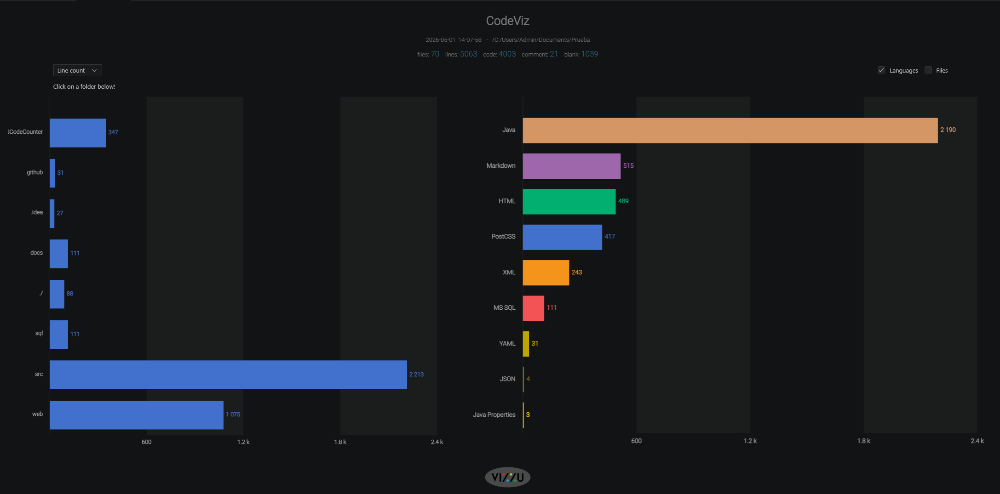

# 🌸 FloristeriaLaBajo


## Proyecto intermodular 1º DAW


**FloristeriaLaBajo** es una floristería online pensada para ofrecer flores bonitas, ecológicas y de buena calidad a todo tipo de público.

La idea principal es crear una plataforma visual, sencilla y atractiva donde cualquier persona pueda encontrar el detalle floral perfecto para una ocasión especial o simplemente para regalar algo bonito.


## 📌Sobre el proyecto


Este proyecto intermodular representa una empresa ficticia del sector floral, orientada a la venta de flores sueltas.

La web servirá como escaparate digital de la floristería, permitiendo mostrar productos, organizar la información de la empresa y facilitar la compra con envío a un destinatario elegido.


## 🎯Objetivo


El objetivo de FloristeriaLaBajo es crear una poryecto acorde a los conocimientos obtenidos desde el inicio de curso hasta hoy e integrar los distintos módulos de 1º de DAW de forma realista, desde la base de datos hasta la programación y la documentación.


## 📚Documentación

```
/FloristeriaLaBajo
├── README.md
├── /web → portal web (HTML/CSS)
├── /src → código fuente de la aplicación Java
├── /sql → scripts de base de datos (MySQL)
├── /diagrams → diagramas E-R y modelo relacional
├── /docs → documentación técnica del proyecto
│   ├── backlog.md 
│   ├── /sistemas → documentación técnica del sistema
│   ├── /empleabilidad → documentación de perfil profesional
│   └── /capturas → capturas del proceso de desarrollo y funcionamiento
└── /.gitignore
```


## 🛠️Stack tecnológico


```
### Frontend

- HTML5

- CSS3
```

```
### Backend

- Java 25 LTS

- JDBC

- Maven
```

```
### Base de datos

- SQL

- MySQL

- DBeaver
```


## Funcionalidades previstas

-> WEB

- Mostrar un inicio limpio y que llame la atenci'on.

- Consultar catalogo de flores.

- Informarse acerca de los valores y poder contactar con la empresa.

->BBDD

-Implementar las Base de Datos para posteriormente trabajarse.

-Crear una serie de Queries útiles para del negocio.

->Java

-Conectarse a BBDD mediante JDBC.

-Implemetar un CRUD completo.


## 🚀Estado actual


- [x] Definición de la empresa.

- [x] Elección del stack tecnológico.

- [x] Idea general del portal web.

- [x] Diseño de la base de datos.

- [x] Desarrollo de la web.

- [x] Programación de la aplicación.

- [x] Documentación final.

->[Backlog del proyecto](docs/BACKLOG.md)


## 📊 Estadísticas  




## 👤Autor


Proyecto realizado para el módulo intermodular de 1º de DAW por Pablo Tomé Manzano, estudiante de 1°DAW.

